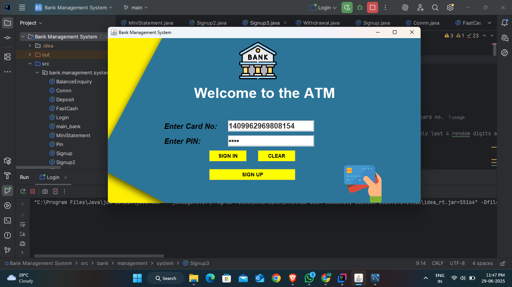
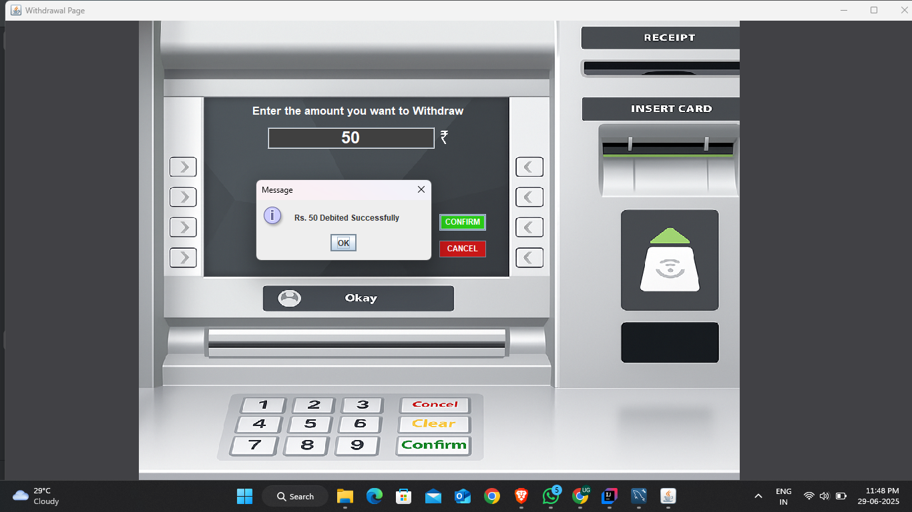
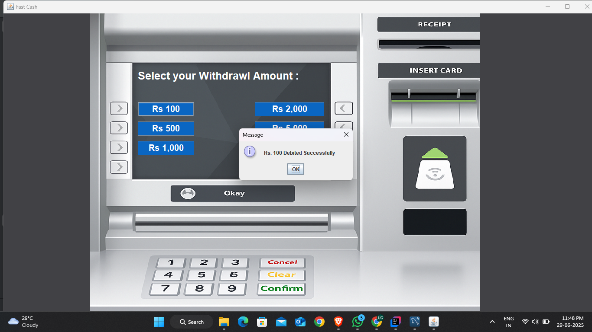
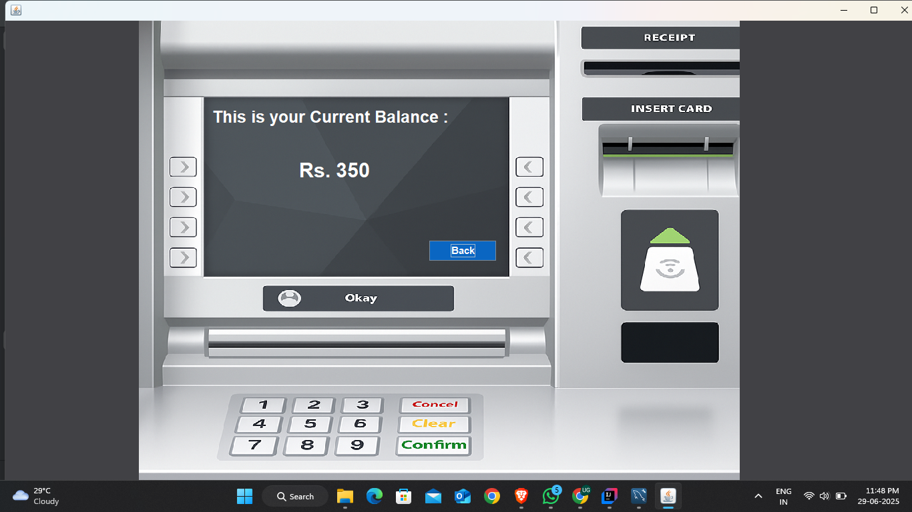
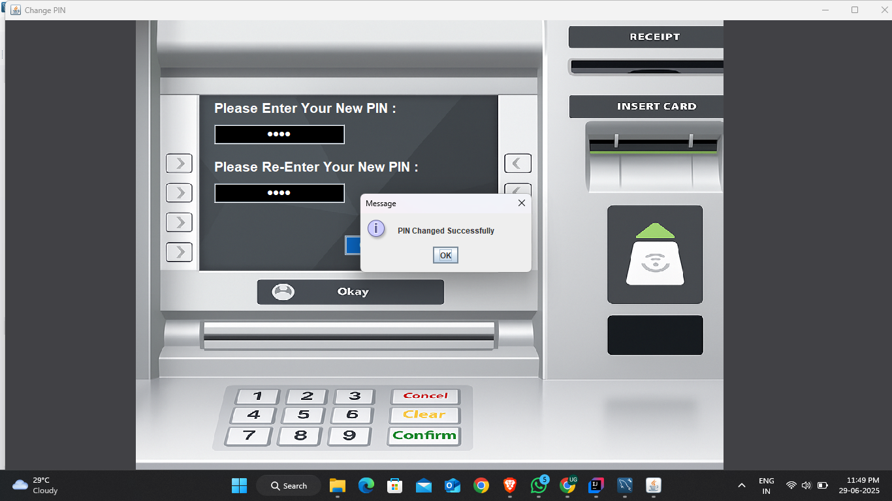
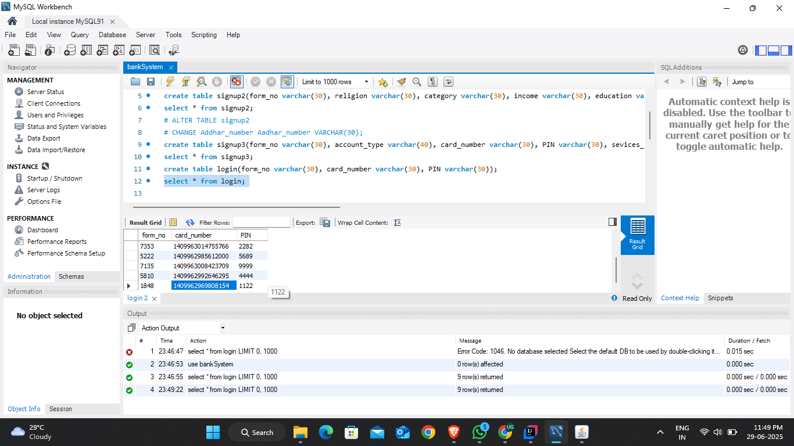
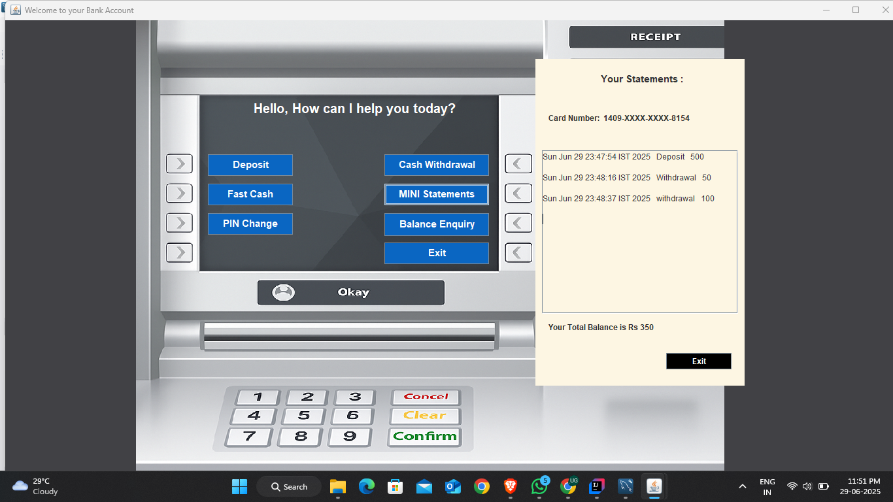

# Bank Management System 💳

A Java-based GUI application for managing basic banking operations like account creation, deposits, withdrawals, and mini-statements. Built using Java Swing for UI and JDBC for database connectivity.

## 🚀 Features
- ✅ User can create new accounts and set their own PIN Code
- 💰 Deposit and withdraw money
- 🧾 Mini-statement generation
- 🔐 PIN-based authentication
- 🗃️ MySQL database support
- 🖥️ Swing-based modern and user friendly UI
  
## Tech Stack
- Java
- Swing
- JDBC
- MySQL

## 📸 Screenshots

### 🏦 Login page

Where new user can click on Signup to create their own accounts, old users can just login with their card and PIN details.

### 💰 Signup Page 1

User have to fill all the necessary details to move forward like his name, Set PIN Code. A unique form no. will be assigned to every new user.

### 🧾 Signup Page 2

For more necessary details like PAN Number, Aadhar Number.

### 🧾 Signup Page 3

Final Page to fill out the details such as account type, services required. An automatic Card no. will be generated and its last 4-digits will be visible on the screen.

### 🧾 New Account Details for login

### 🧾 Your New generated Card Number and PIN will be stored in the backend

### 🧾 You may enter your details to login to your account

### 🧾 Welcome to your Bank 

### 🧾 By clicking on Deposit button You will be redirected to this page here you can deposit your amount

### 🧾 Go to Withdraw button to withdraw money from your account 

### Note:- Your Amount should not Exceed the account balance else you will see an error {insufficient balance}

### 🧾 Fast Cash to withdraw quick ammount 

### 🧾 User can check their balance by going to Balance Enquiry

### 🧾 User can Change their PIN any time by going to Change PIN Option

### Note:- Make sure to enter and re-enter correct so you won't get error {PIN does not match}

### 🧾 PIN will also be then changed in the database so user can use this new PIN to Login next time

### 🧾 User can generate MINI Statements of all the previous transaction history and time.

---
