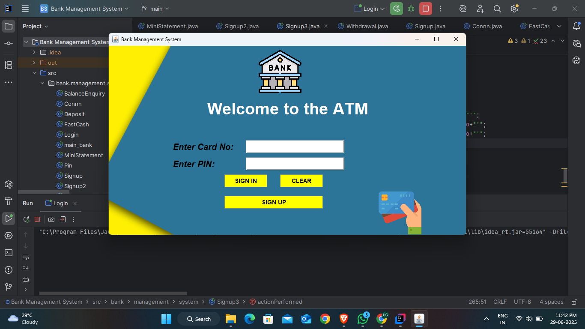
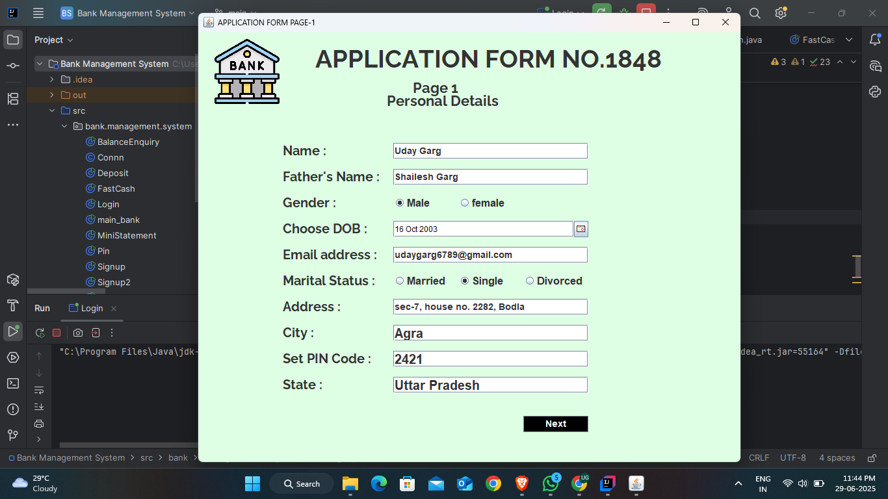
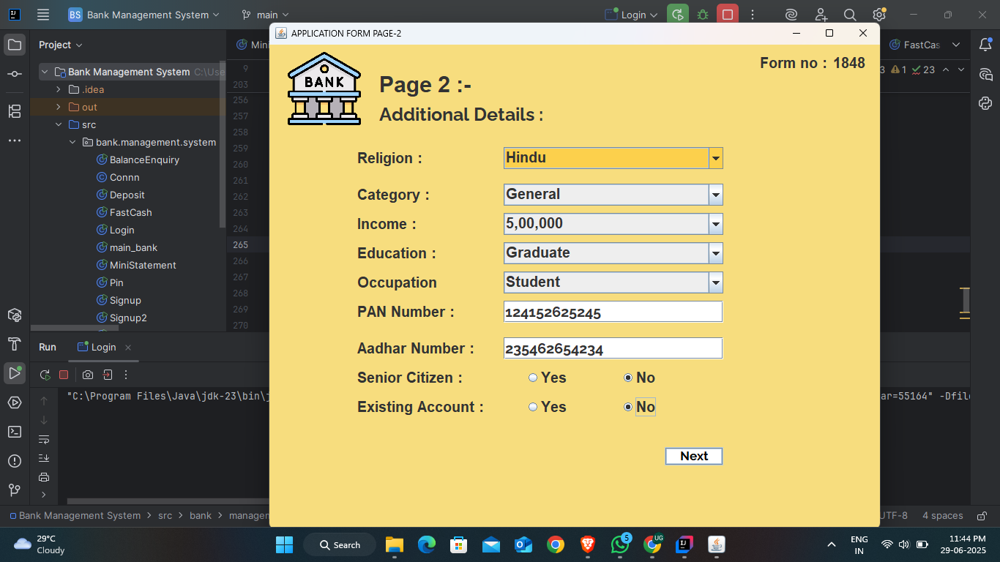
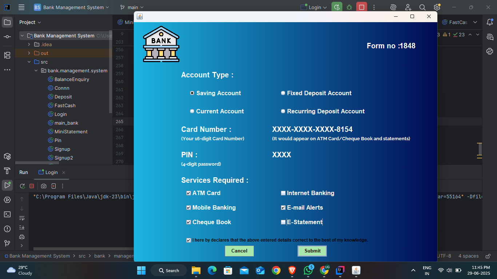
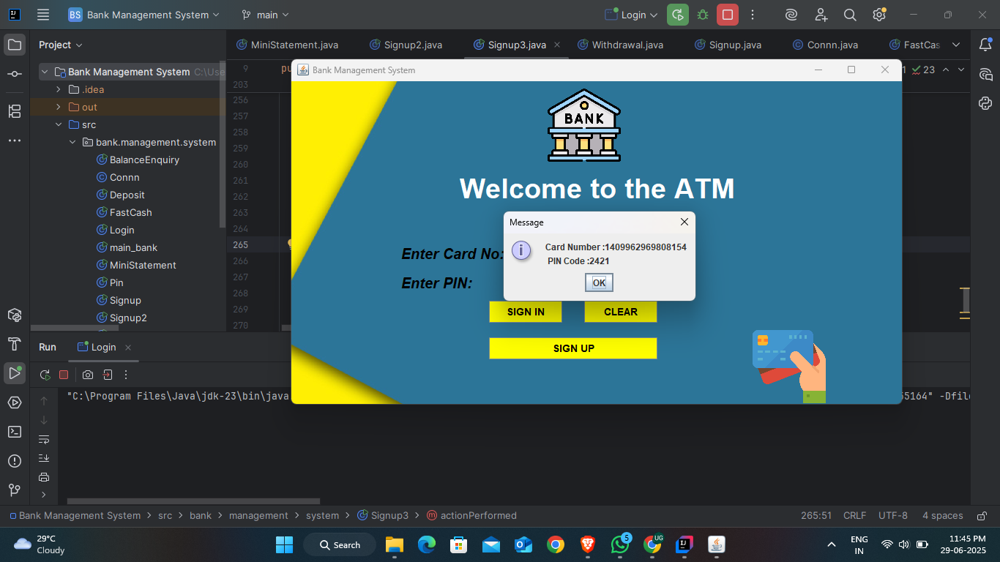

# Bank Management System 💳

A Java-based GUI application for managing basic banking operations like account creation, deposits, withdrawals, and mini-statements. Built using Java Swing for UI and JDBC for database connectivity.

## 🚀 Features
- ✅ User can create new accounts and set their own PIN Code
- 💰 Deposit and withdraw money
- 🧾 Mini-statement generation
- 🔐 PIN-based authentication
- 🗃️ MySQL database support
- 🖥️ Swing-based modern and user friendly UI
  
## Tech Stack
- Java
- Swing
- JDBC
- MySQL

## 📸 Screenshots

### 🏦 Login page

Where new user can click on Signup to create their own accounts, old users can just login with their card and PIN details.

### 💰 Signup Page 1

User have to fill all the necessary details to move forward like his name, Set PIN Code. A unique form no. will be assigned to every new user.

### 🧾 Signup Page 2

For more necessary details like PAN Number, Aadhar Number.

### 🧾 Signup Page 3

Final Page to fill out the details such as account type, services required. An automatic Card no. will be generated and its last 4-digits will be visible on the screen.

### 🧾 New Account Details for login

### 🧾 Signup Page 2

### 🧾 Signup Page 2

---
